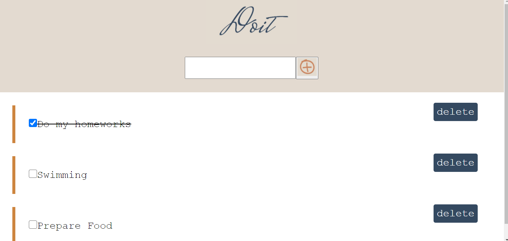

# Doit

<!-- PROJECT LOGO -->
 

  

  <h2 align="center"><a href="https://webahead7.github.io/Doit/">Try our NEW APP</h2>

<!-- TABLE OF CONTENTS -->
## Table of Contents

* [About the Project](#about-the-project)
* [Getting Started](#getting-started)
* [Built With](#built-with)
* [Contact](#contact)

<!-- ABOUT THE PROJECT -->
## About The Project

  
Doit helps you achieve both short-term and long-term goals for your life. You don't need to feel overwhelmed by a massive amount of work. Just keep track of today's tasks, and get things done!

<!-- GETTING STARTED -->
## Getting Started

1) Add your To-Do and Click on "Add" button.
2) In the main screen you can see your new To-Do has been added.
3) click on "delete" to delete your To-Do item.
4) click on "checkbox" if you have completed your To-Do.

## Built With
* HTML
* CSS
* JS

<!-- CONTACT -->
## Contact

* Nizar : [@GitHub](https://github.com/nizarhalloun)
* Omklthom :  [@GitHub](https://github.com/OmklthomAmara)
* Lujain :  [@GitHub](https://github.com/Lujain-AbdUllatif)

